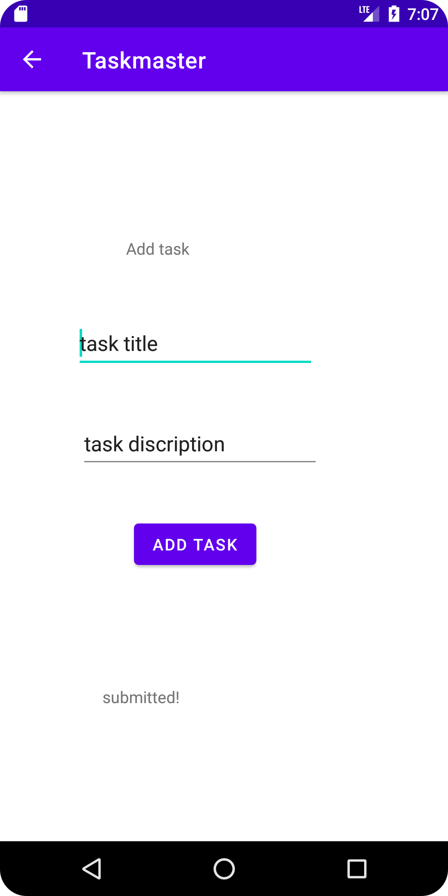
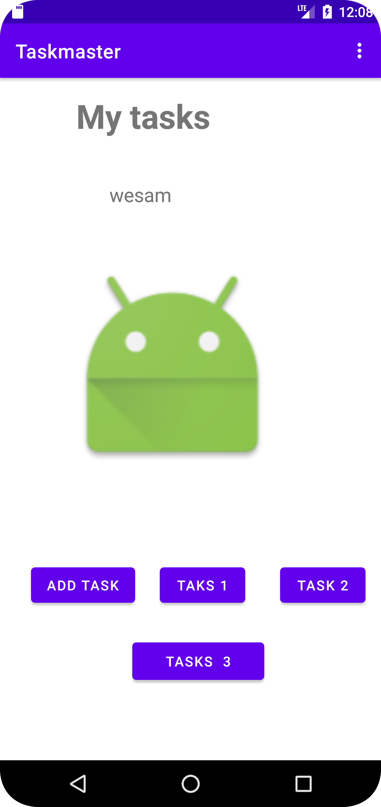
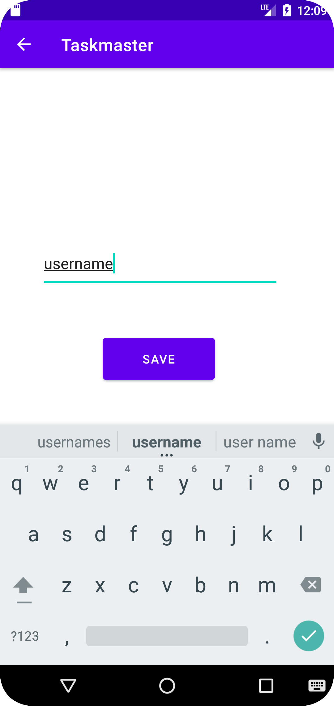
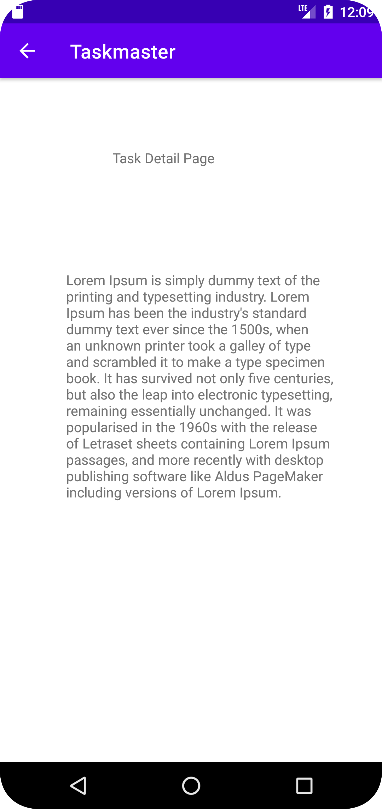

# taskmaster
## screenshots for the project

## how it is works
Homepage
Refactor your homepage’s RecyclerView to display all Task entities in your database  
Add a Task 
Modify your Add Task form to save the data entered in as a Task in your local database. 

Detail Page 
Ensure that the description and status of a tapped task are also displayed on the detail page, in addition to the title. (Note that you can accomplish this by passing along the entire Task entity, or by passing along only its ID in the intent.) 

Task Model and Room 
Following the directions provided in the Android documentation, set up Room in your application, and modify your Task class to be an Entity. 

