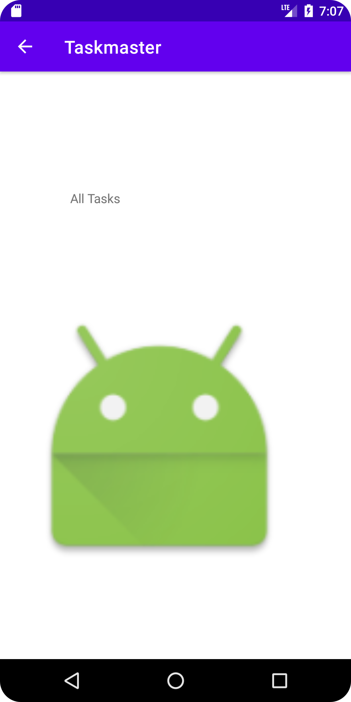

# taskmaster
## screenshots for the project

## how it is works
Homepage
The it  have a heading at the top of the page, an image to mock the “my tasks” view, and buttons at the bottom of the page to allow going to the “add tasks” and “all tasks” page. 

Add a Task 
On the “Add a Task” page, allow users to type in details about a new task, specifically a title and a body. When users click the “submit” button, show a “submitted!” label on the page. 

All Tasks 
The all tasks page should just be an image with a back button; it needs no functionality. 

